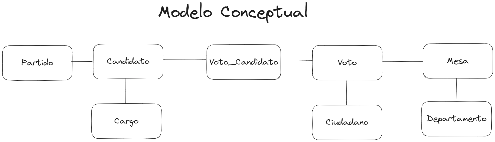
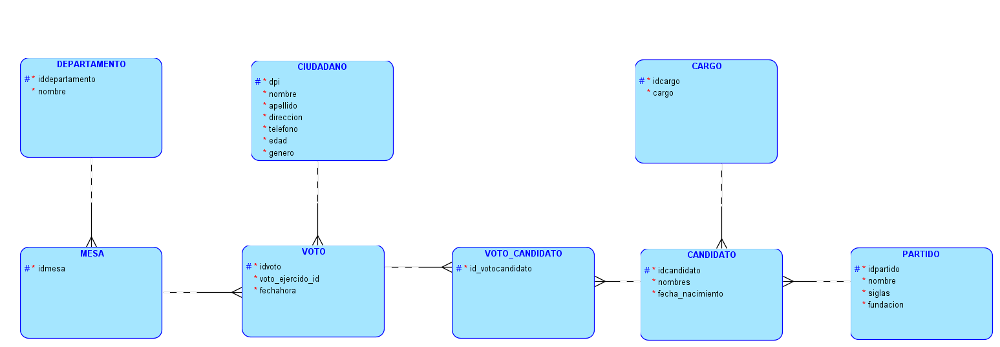
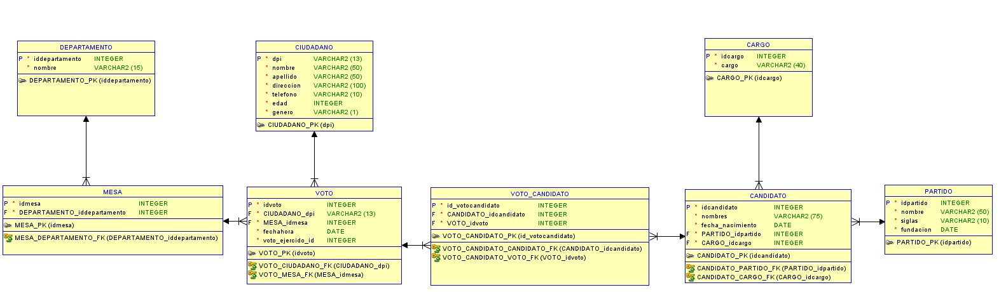

# Proyecto 1

```JSON
{
    "Universidad": "Universidad de San Carlos de Guatemala",
    "Facultad": "Facultad de Ingeniería",
    "Escuela": "Escuela de Ciencias y Sistemas",
    "Curso": "Sistema de Bases de Datos 1",
    "Sección": "A",
    "Periodo":"Segundo Semestre 2023"
}
```

| Carnet    | Nombre                            |
|-----------|-----------------------------------|
| 201900042 |Rodrigo Alejandro Hernández de León|

# Manual Técnico

## Índice
1. [Requerimientos](##Requerimientos)
    - [Tecnologías](###Tecnologías)
    - [Herramientas](###Herramientas)
2. [Modelos de bases de datos](##Modelos-de-bases-de-datos)
    - [Modelo Conceptual](###Modelo-Conceptual)
    - [Modelo Lógico](###Modelo-Lógico)
    - [Modelo Físico](###Modelo-Físico)

## Requerimientos

### Tecnologías
- nodejs: v18.17.0
- npm 9.6.7
- mysql 8.1.0

### Herramientas
- Visual Studio Code
- MySQL Workbench / DataGrip
- Postman

## Modelos de bases de datos

En la siguiente sección se mostrarán los modelos de bases de datos utilizados para el proyecto.

- ### Modelo Conceptual

Descripcion...



- ### Modelo Lógico

Descripcion...



- ### Modelo Físico

Descripcion...



## Creación de la base de datos

Para la creación de la base de datos se realizo lo siguiente:

Descripcion...

## Endpoints a la API

Para poder hacer pruebas de las consultas a la base de datos, puede utilizar los siguientes endpoints:

|Endpoint| Tipo | Descripción |
|--------|------|-------------|
|`/`|`GET`|Retorna un mensaje de bienvenida|
|`/cargarmodelo`|`GET`| Crea las tablas del modelo de la base de datos|
|`/cargartabtemp`|`GET`| Crea las tablas temporales de la base de datos, posteriormente carga los datos de las tablas temporales a las tablas del modelo y por último se eliminan las tablas temporales |
|`/eliminarmodelo`|`DELETE`| Elimina las tablas del modelo de la base de datos|
|`/consulta1`|`GET`|Muestra el nombre de los candidatos a presidentes y vicepresidentes por partido.|
|`/consulta2`|`GET`|Muestra el número de candidatos a diputados por cada partido.|
|`/consulta3`|`GET`|Muestra el nombre de los candidatos a alcalde por partido|
|`/consulta4`|`GET`|Muestra la cantidad de candidatos por partido|
|`/consulta5`|`GET`|Muestra la cantidad de votos por departamentos|
|`/consulta6`|`GET`|Muestra la cantidad de votos nulos|
|`/consulta7`|`GET`|Muestra el top 10 de edad de ciudadanos que realizaron su voto.|
|`/consulta8`|`GET`|Muestra el top 10 de candidatos más votados para presidente y vicepresidente|
|`/consulta9`|`GET`|Muestra el top 5 de mesas más frecuentadas|
|`/consulta10`|`GET`|Muestra el top 5 la hora más concurrida en que los ciudadanos fueron a votar.|
|`/consulta11`|`GET`|Muestra la cantidad de votos por genero donde `F` es Femenino y `M` es Masculino|